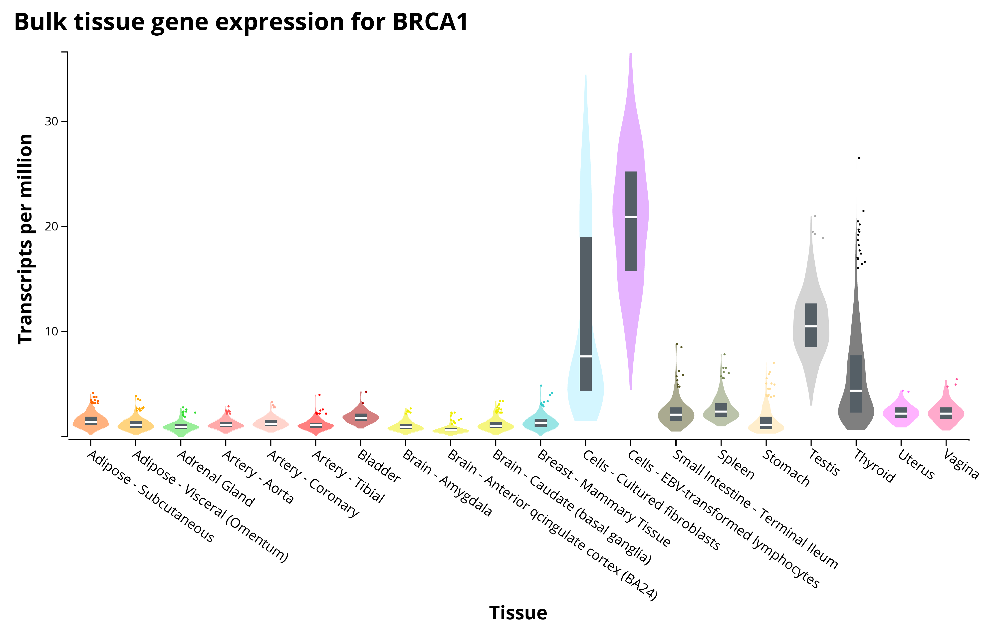

# Lab 3: Logical Subsetting and Conditional Filtering {#lab3}

```{block, type='objectives'}

**Objectives:**

1. To understand Boolean logic (AND, OR, NOT) in programming
2. To use logical comparisons to build TRUE/FALSE vectors
3. To use conditional filters to isolate specific rows of a data set
4. To apply subsetting to isolate biological variables or categories of interest
```

Last lab we learned to build vectors and data frames. Today we will learn how to ask `R` questions about our data and pull out only the rows that answer "yes."

## Logical comparisons

`R` can evaluate whether a statement is `TRUE` or `FALSE` using comparison operators:

| Operator | Meaning |
|---|---|
| `==` | equal to |
| `!=` | not equal to |
| `>` | greater than |
| `<` | less than |
| `>=` | greater than or equal to |
| `<=` | less than or equal to |

```{r}
5 > 3
5 == 3
"cat" == "dog"
"cat" == "cat"
```

These comparisons also work element-wise on a whole vector:

```{r}
nums <- c(2, 5, 8, 1, 9, 4)
nums > 4
```

```{block, type='rmdquestion'}
#### Question 1

- Create a numeric vector called `ages` with 8 numbers between 1 and 100
- Write the code to check which elements of `ages` are greater than 30
- Write the code to check which elements of `ages` are exactly equal to 18
```

## Boolean logic: AND, OR, NOT

Often we want to combine more than one condition:

| Symbol | Meaning |
|---|---|
| `&` | AND — both conditions must be TRUE |
| `\|` | OR — at least one condition must be TRUE |
| `!` | NOT — flips TRUE to FALSE and vice versa |

```{r}
x <- c(2, 5, 8, 1, 9, 4)

# AND: greater than 3 AND less than 9
x > 3 & x < 9

# OR: less than 2 OR greater than 8
x < 2 | x > 8

# NOT: the reverse of x > 4
!(x > 4)
```

```{block, type='rmdquestion'}
#### Question 2

- Using your `ages` vector from Question 1, write code that identifies which values are between 18 and 65 (inclusive) using `&`
- Write code that identifies which values are younger than 18 OR older than 65 using `|`
- Explain, in your own words, the difference between `&` and `|`
```

## Subsetting vectors and data frames

Once you have a logical (TRUE/FALSE) vector, you can use it inside square brackets `[ ]` to pull out only the elements where the condition is `TRUE`.

```{r}
x <- c(2, 5, 8, 1, 9, 4)
x[x > 4]
```

The same idea extends to data frames, but now we have to say whether we are filtering **rows** or **columns**. Recall from Lab 2 that data frames use `dataframe[rows, columns]` syntax.

```{r}
species <- c("frog", "frog", "toad", "toad", "salamander")
length_mm <- c(45, 52, 38, 41, 60)
site <- c("pond1", "pond2", "pond1", "pond2", "pond1")

herps <- data.frame(species, length_mm, site, stringsAsFactors = FALSE)
herps
```

To get only the rows where `species` is `"frog"`:

```{r}
herps[herps$species == "frog", ]
```

The `subset()` function does the same thing with slightly friendlier syntax:

```{r}
subset(herps, species == "frog")
```

You can combine conditions with `&` and `|` inside `subset()` as well:

```{r}
subset(herps, species == "frog" & length_mm > 48)
```

```{block, type='rmdquestion'}
#### Question 3

- Using the `herps` data frame above (or a similar data frame you build with at least 8 rows and one categorical + one numeric column), write code to:
    - Subset only the rows collected at `"pond1"`
    - Subset only the rows where `length_mm` is greater than 40 AND `site` is `"pond1"`
    - Subset the rows where `species` is NOT `"toad"` (use `!=`)
- For each, explain in one sentence what biological question that subset could help answer
```

## Isolating specific variants or categories of interest

In genomics and ecology, filtering is often used to isolate specific variants, genes, or categories of interest from a much larger data set before further analysis. 

For example, to make plots like this:



We need to have these types of data:

```{r}
gene_id <- c("g001","g002","g003","g004","g005","g006")
chromosome <- c(1, 1, 2, 3, 3, 2)
expression <- c(12.4, 0.3, 8.9, 15.2, 0.1, 22.7)

gene.table <- data.frame(gene_id, chromosome, expression, stringsAsFactors = FALSE)
gene.table
```

For example, to isolate genes on chromosome 3 that show high expression (say, above 10):

```{r}
subset(gene.table, chromosome == 3 & expression > 10)
```

```{block, type='rmdquestion'}
#### Question 4

- Using the `gene.table` example (or a similar table of your own with at least 8 rows), write code to isolate genes with expression below 1 (candidates for "not expressed")
- Write code to isolate genes on chromosome 1 OR chromosome 2
- Why might a biologist want to filter out low-expression genes before doing further statistical analysis? (This is a conceptual question — think about noise vs. signal)
```
